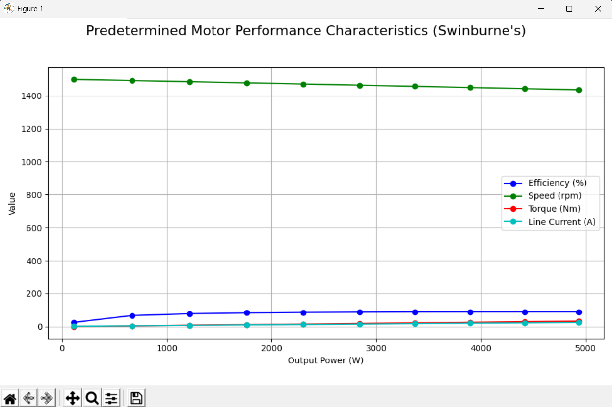
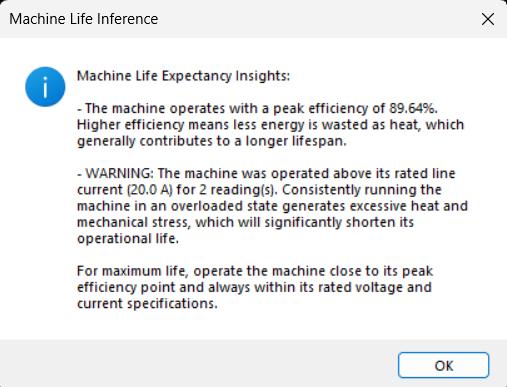
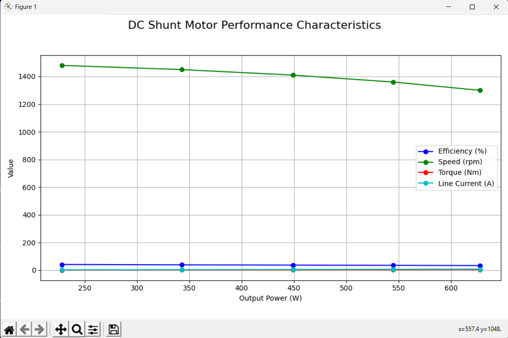
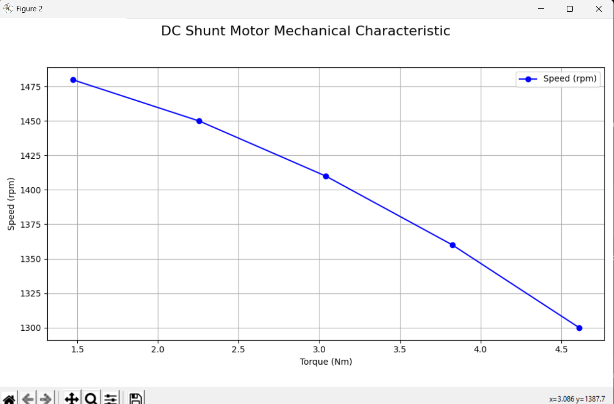

Sure — here is a complete polished `README.md` you can paste directly into GitHub.

```md
# DC Motor Performance Analyzer

A Python-based GUI application for analyzing the performance of DC machines using **Swinburne's Test** and **load tests on DC Series and DC Shunt motors**.

This project was developed as an **Object-Oriented Programming (OOP)** application and demonstrates inheritance, encapsulation, abstraction, code reusability, GUI programming, numerical computation, plotting, and file handling.

---

## Features

- Graphical user interface using Tkinter
- Swinburne's Test
  - Motor operation
  - Generator operation
- Load test on DC Series Motor
- Load test on DC Shunt Motor
- Calculates:
  - Efficiency
  - Output Power
  - Speed
  - Torque
  - Line / Load Current
- Generates performance-characteristic graphs
- Provides qualitative machine-life insights
- Detects operation above rated current
- Saves calculated results as CSV files
- Loads previously saved CSV files
- Re-plots stored test results

---

## OOP Concepts Used

### 1. Classes and Objects

The application is organized using multiple classes:

- `BaseMotorTest`
- `SwinburnesTest`
- `LoadTest`
- `SeriesMotorLoadTest`
- `ShuntMotorLoadTest`
- `MotorTestApp`

Objects of these classes are created to perform the required motor tests and manage the GUI application.

---

### 2. Inheritance

Inheritance is used extensively to avoid code duplication.

`SwinburnesTest` and `LoadTest` inherit common functionality from:

```python
BaseMotorTest
```

The load-test classes:

```python
SeriesMotorLoadTest
ShuntMotorLoadTest
```

inherit from:

```python
LoadTest
```

This allows common functions such as plotting, file handling, and machine-life inference to be reused.

The class hierarchy is approximately:

```text
BaseMotorTest
├── SwinburnesTest
└── LoadTest
    ├── SeriesMotorLoadTest
    └── ShuntMotorLoadTest
```

---

### 3. Encapsulation

Related data and operations are grouped inside classes.

For example, the `LoadTest` class contains the methods and variables required for:

- Reading motor test inputs
- Performing calculations
- Generating graphs
- Saving results

This keeps the code organized and easier to maintain.

---

### 4. Abstraction

The GUI hides the internal mathematical calculations from the user.

The user only needs to:

1. Select a motor test
2. Enter the required values
3. Click **Calculate & Plot**

The program handles the calculations and displays the results automatically.

---

### 5. Polymorphism / Specialization

`SeriesMotorLoadTest` and `ShuntMotorLoadTest` use the same common load-test implementation while representing different types of DC motors.

The motor type is provided through the class constructor.

---

### 6. Code Reusability

Several common methods are reused throughout the program, including:

```python
plot_graph()
save_results_to_file()
load_results_from_file()
get_motor_life_inference()
```

This reduces repeated code and improves maintainability.

---

## Project Structure

```text
dc-motor-performance-analyzer/
├── src/
│   └── motor_performance_analyzer.py
├── data/
│   └── sample_shunt_load_results.csv
├── docs/
│   ├── OOP_CONCEPTS.md
│   └── USAGE.md
├── images/
│   └── output/
│       ├── main_window.png
│       ├── swinburne_motor_graph.png
│       ├── machine_life_inference.png
│       ├── load_test_graph.png
│       └── torque_speed_characteristic.png
├── LICENSE
├── README.md
└── requirements.txt
```

---

## Requirements

The project requires:

- Python 3.10 or newer recommended
- NumPy
- Matplotlib
- Tkinter

The `csv` module used for file handling is included with Python.

---

## Installation

Clone the repository:

```bash
git clone https://github.com/Sudeep2603/dc-motor-performance-analyzer.git
```

Move into the project folder:

```bash
cd dc-motor-performance-analyzer
```

Install the required Python packages:

```bash
pip install -r requirements.txt
```

---

## Run the Application

Run the following command:

```bash
python src/motor_performance_analyzer.py
```

The **Motor Performance Analyzer** GUI will open.

---

## Available Experiments

The application provides three main options:

### Swinburne's Test

Swinburne's Test can be used to predetermine the performance of a DC machine.

The program supports:

- Motor operation
- Generator operation

The program calculates and plots relevant performance characteristics such as:

- Efficiency
- Output Power
- Speed
- Torque
- Line Current

---

### Load Test on DC Series Motor

The load-test module accepts experimental readings and calculates:

- Input Power
- Output Power
- Torque
- Efficiency
- Speed

Performance characteristics are then plotted.

---

### Load Test on DC Shunt Motor

The same load-test framework is used for the DC Shunt Motor.

The application generates:

- Performance characteristics
- Torque-Speed characteristics
- Efficiency values
- Machine-life insights

---

## How to Use

1. Run the Python program.
2. Select the required experiment.
3. Enter the requested motor or test values.
4. Click **Calculate & Plot**.
5. View the generated performance graph.
6. Read the machine-life inference.
7. Save the calculated results if required.
8. Saved CSV files can later be loaded from the application's **File** menu.

For a more detailed guide, see:

[docs/USAGE.md](docs/USAGE.md)

---

## File Handling

The application supports saving calculated results in CSV format.

Examples of saved parameters include:

- Voltage
- Current
- Speed
- Torque
- Efficiency
- Output Power

Previously saved CSV files can also be loaded into the application and plotted again.

A sample result file is provided in:

```text
data/sample_shunt_load_results.csv
```

---

## Output Screenshots

### Main Application Window


---

### Swinburne's Test - Motor Performance Characteristics



---

### Machine Life Inference



---

### DC Shunt Motor Performance Characteristics



---

### DC Shunt Motor Torque-Speed Characteristic



---

## Machine-Life Inference

The application provides a qualitative indication of machine operating condition.

The inference considers factors such as:

- Peak operating efficiency
- Rated current
- Number of readings exceeding rated current

Operating the motor above its rated current can increase heating and electrical and mechanical stress, which may reduce machine life.

The program therefore warns the user when overload conditions are detected.

> **Note:** The application does not calculate an exact remaining lifetime in hours or years. The output is intended as a qualitative machine-life insight based on the available operating parameters.

---

## Technologies Used

- Python
- Tkinter
- NumPy
- Matplotlib
- CSV File Handling
- Object-Oriented Programming

---

## Applications

This project can be useful for:

- Electrical machine laboratory analysis
- DC motor performance study
- OOP demonstration using a practical engineering application
- Visualization of motor characteristics
- Educational purposes
- Basic motor test data analysis

---

## Future Improvements

Possible future developments include:

- Support for additional DC machine tests
- Exporting results directly to Excel
- Automatic PDF report generation
- Improved graph customization
- Database storage for previous experiments
- Thermal modelling of the motor
- More advanced machine-health analysis
- Remaining Useful Life estimation using temperature, loading history, and ageing models

---

## License

This project is licensed under the **MIT License**.

See the `LICENSE` file for more information.

---

## Author

**Sudeep B**  
B.Tech Electronics and Computer Engineering  
Amrita Vishwa Vidyapeetham, Coimbatore

Object-Oriented Programming Project
```

One thing: make sure `Sudeep2603` is actually your GitHub username. If your username is different, replace this line:

```bash
git clone https://github.com/Sudeep2603/dc-motor-performance-analyzer.git
```

with your real GitHub repository URL.
