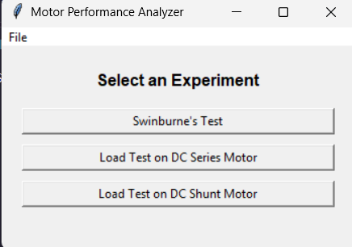

# DC Motor Performance Analyzer

A Python-based GUI application for analyzing the performance of DC machines using **Swinburne's Test** and **load tests on DC Series and DC Shunt motors**.

The project was developed as an **Object-Oriented Programming (OOP)** application and demonstrates inheritance, encapsulation through classes and methods, code reuse, GUI programming, numerical computation, plotting, and file handling.

## Features

- Graphical user interface using Tkinter
- Swinburne's Test
  - Motor operation
  - Generator operation
- Load test on DC Series Motor
- Load test on DC Shunt Motor
- Calculates:
  - Efficiency
  - Output power
  - Speed
  - Torque
  - Line/load current
- Generates performance-characteristic graphs
- Gives qualitative machine-life insights based on efficiency and rated-current operation
- Saves calculated results as CSV files
- Loads previously saved CSV data and plots it again

## OOP Concepts Used

### 1. Classes and Objects
The project is organized using classes such as:

- `BaseMotorTest`
- `SwinburnesTest`
- `LoadTest`
- `SeriesMotorLoadTest`
- `ShuntMotorLoadTest`
- `MotorTestApp`

Objects of these classes are created to perform the required tests and manage the application.

### 2. Inheritance
`SwinburnesTest` and `LoadTest` inherit common functionality from `BaseMotorTest`.

`SeriesMotorLoadTest` and `ShuntMotorLoadTest` inherit from `LoadTest`.

This avoids repeating common functions such as graph plotting, file handling, and machine-life inference.

### 3. Method Overriding / Specialization
The child motor-test classes use the common `LoadTest` implementation while supplying their own motor type through their constructors.

### 4. Encapsulation
Related data and operations are grouped inside classes. For example, input handling, calculations, plotting, and saving results are implemented as methods belonging to the relevant class.

### 5. Abstraction
The GUI allows the user to select a test and enter experimental values without having to deal directly with the internal mathematical calculations.

### 6. Code Reusability
Functions such as `plot_graph()`, `save_results_to_file()`, `load_results_from_file()`, and `get_motor_life_inference()` are reused by different tests.

## Project Structure

```text
dc-motor-performance-analyzer/
├── src/
│   └── motor_performance_analyzer.py
├── data/
│   └── .gitkeep
├── docs/
│   ├── OOP_CONCEPTS.md
│   └── USAGE.md
├── images/
│   └── output/
│       └── .gitkeep
├── .gitignore
├── README.md
└── requirements.txt
```

## Requirements

- Python 3.10 or newer recommended
- NumPy
- Matplotlib
- Tkinter

`csv` is part of the Python standard library.

## Installation

Clone the repository:

```bash
git clone https://github.com/YOUR-USERNAME/dc-motor-performance-analyzer.git
cd dc-motor-performance-analyzer
```

Install the required Python packages:

```bash
pip install -r requirements.txt
```

## Run the Application

```bash
python src/motor_performance_analyzer.py
```

The main window lets you select one of the available experiments.

## How to Use

1. Run the Python program.
2. Select an experiment from the main GUI.
3. Enter the requested machine/test values.
4. Click **Calculate & Plot**.
5. View the generated characteristics.
6. Read the machine-life inference.
7. Save the output to a CSV file if required.
8. Saved CSV files can later be loaded from the application's **File** menu.

For more details, see [docs/USAGE.md](docs/USAGE.md).

## Output Screenshots

Add screenshots of your program to `images/output/`.

Example:

```markdown


```

After adding screenshots, you can place these lines in this README so the images are shown directly on GitHub.

## Technologies Used

- Python
- Tkinter
- NumPy
- Matplotlib
- CSV file handling

## Notes

The machine-life output is a qualitative inference based on the calculated efficiency and whether the entered operating current exceeds the rated current. It should not be treated as a detailed remaining-useful-life prediction.

## Author

**Sudeep B**

Electronics Engineering Project — Object-Oriented Programming
